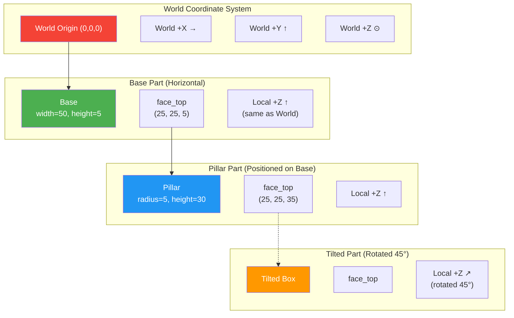
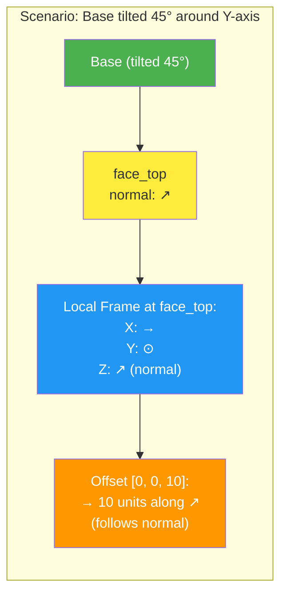

# Local Frame Offsets

This diagram illustrates how offsets work in local coordinate frames vs world space.

## World Coordinates vs Local Frames



## Offset Behavior

### Without Local Frames (World Coordinates)

```yaml
parts:
  pillar:
    primitive: cylinder
    parameters: {radius: 5, height: 30}
    translate:
      to:
        from: base.face_top
        offset: [10, 0, 5]  # ❌ Always in world X,Y,Z
```

**Result:** Offset is `[10, 0, 5]` in world space, regardless of base orientation.

### With Local Frames (TiaCAD v3.0+)

```yaml
parts:
  pillar:
    primitive: cylinder
    parameters: {radius: 5, height: 30}
    translate:
      to:
        from: base.face_top
        offset: [10, 0, 5]  # ✅ In base.face_top's local frame!
```

**Result:** Offset follows the local coordinate system at `base.face_top`:
- `[10, 0, 5]` means: 10 units along local X, 0 along local Y, 5 along local Z

## Visual Example: Tilted Surface



## Code Comparison

### World Coordinates (Manual Math)

```yaml
# ❌ Hard to read, error-prone
parts:
  cap:
    translate: [32.5, 25, 40]  # Where did these numbers come from?
```

### Local Frame Offsets (Intuitive)

```yaml
# ✅ Clear intent, follows geometry
parts:
  cap:
    translate:
      to:
        from: pillar.face_top
        offset: [0, 0, 5]  # 5 units above pillar, easy!
```

## Benefits of Local Frames

| Benefit | Description |
|---------|-------------|
| **Intuitive** | Offsets relative to surface orientation |
| **Robust** | Works even if base part is rotated |
| **Self-documenting** | Clear spatial relationships |
| **Less math** | No manual coordinate calculations |

## Technical Details

Each anchor (e.g., `base.face_top`) provides:
1. **Position** - (x, y, z) point in world space
2. **Normal** - Direction perpendicular to surface (local Z)
3. **Tangent** - Direction along surface (local X)
4. **Bitangent** - Second direction along surface (local Y)

Together, these form a **local coordinate frame** for offset calculations.

## Common Use Cases

### Stack Parts Vertically

```yaml
translate:
  to: base.face_top
  offset: [0, 0, 2]  # 2 units above, following normal
```

### Position to the Side

```yaml
translate:
  to: base.face_right
  offset: [0, 5, 0]  # 5 units outward from face
```

### Complex Assemblies

```yaml
translate:
  to: mounting_plate.face_top
  offset: [15, -10, 3]  # Offset in plate's local frame
```

**Key Insight:** You describe position relative to the surface, not in absolute world space.
