# Operation Categories

This diagram illustrates the four types of operations in TiaCAD and when to use each.

## The Four Operation Types

```mermaid
graph TD
    subgraph "1. Positioning Operations (Transforms)"
        pos_icon["📍 Move, Rotate, Scale"]
        pos_purpose["Purpose: Change where parts are"]
        pos_examples["translate, rotate, scale"]

        pos_icon --> pos_purpose
        pos_purpose --> pos_examples
    end

    subgraph "2. Shape Modification Operations (Features)"
        mod_icon["✏️ Change Shape"]
        mod_purpose["Purpose: Modify part geometry"]
        mod_examples["fillet, chamfer, extrude, revolve, sweep, loft"]

        mod_icon --> mod_purpose
        mod_purpose --> mod_examples
    end

    subgraph "3. Combining Operations (Booleans)"
        bool_icon["🔗 Merge or Subtract"]
        bool_purpose["Purpose: Combine multiple parts"]
        bool_examples["union, difference, intersection"]

        bool_icon --> bool_purpose
        bool_purpose --> bool_examples
    end

    subgraph "4. Replication Operations (Patterns)"
        rep_icon["📋 Make Copies"]
        rep_purpose["Purpose: Duplicate parts in patterns"]
        rep_examples["linear_pattern, circular_pattern, grid_pattern"]

        rep_icon --> rep_purpose
        rep_purpose --> rep_examples
    end

    style pos_icon fill:#4caf50,color:#fff
    style mod_icon fill:#2196f3,color:#fff
    style bool_icon fill:#ff9800,color:#fff
    style rep_icon fill:#e91e63,color:#fff
```



## Detailed Breakdown

### 1. Positioning Operations (Transforms) 📍

**Think of it as:** Moving furniture around a room

```mermaid
graph LR
    before["Original Part<br/>at origin"]
    translate["→ translate<br/>[10, 0, 5]"]
    after["Moved Part<br/>at new position"]

    before --> translate --> after

    style before fill:#e0e0e0
    style translate fill:#4caf50,color:#fff
    style after fill:#4caf50,color:#fff
```



**Operations:**
- `translate` - Move to a position
- `rotate` - Spin around an axis
- `scale` - Make bigger or smaller

**Example:**
```yaml
operations:
  pillar_positioned:
    type: transform
    targets: [pillar]
    transforms:
      - translate: {to: base.face_top}
      - rotate: {angle: 45, axis: Z, origin: current}
```

---

### 2. Shape Modification Operations (Features) ✏️

**Think of it as:** Sculpting or machining a part


**Operations:**

**Finishing:**
- `fillet` - Round edges
- `chamfer` - Bevel edges

**Sketch-Based:**
- `extrude` - Push 2D sketch into 3D
- `revolve` - Spin 2D profile around axis
- `sweep` - Drag profile along path
- `loft` - Blend between profiles

**Example:**
```yaml
operations:
  rounded_plate:
    type: fillet
    targets: [plate]
    radius: 3
    edges:
      selector: ">Z"  # Round top edges
```

---

### 3. Combining Operations (Booleans) 🔗

**Think of it as:** Adding or subtracting clay


**Operations:**
- `union` - Merge parts together (A + B)
- `difference` - Subtract parts (A - B)
- `intersection` - Keep only overlap (A ∩ B)

**Example:**
```yaml
operations:
  plate_with_holes:
    type: difference
    base: mounting_plate
    subtract: [hole1, hole2, hole3, hole4]
```

---

### 4. Replication Operations (Patterns) 📋

**Think of it as:** Using a stamp to make copies

```mermaid
graph LR
    original["Original<br/>Part"]
    pattern["→ circular_pattern<br/>count: 6"]
    copies["6 Copies<br/>in circle"]

    original --> pattern --> copies

    style original fill:#e0e0e0
    style pattern fill:#e91e63,color:#fff
    style copies fill:#e91e63,color:#fff
```



**Operations:**
- `linear_pattern` - Line of copies
- `circular_pattern` - Circle of copies (bolt patterns)
- `grid_pattern` - 2D array of copies

**Example:**
```yaml
operations:
  bolt_circle:
    type: circular_pattern
    targets: [screw_hole]
    count: 6
    radius: 40
    center: [0, 0, 0]
```

---

## Operation Type Decision Tree


## When to Use Each Type

| Scenario | Operation Type | Example |
|----------|---------------|---------|
| Stack boxes | Positioning | `translate: {to: base.face_top}` |
| Round sharp edges | Shape Modification | `fillet: {radius: 2, edges: ">Z"}` |
| Cut holes in plate | Combining | `difference: {base: plate, subtract: [holes]}` |
| Create bolt circle | Replication | `circular_pattern: {count: 6, radius: 40}` |
| Position multiple parts | Positioning | `translate` each part to anchors |
| Create bottle shape | Shape Modification | `revolve: {sketch: profile, axis: Z}` |
| Merge support beams | Combining | `union: {parts: [beam1, beam2]}` |
| Array of pins | Replication | `grid_pattern: {count_x: 5, count_y: 5}` |

## Combining Operation Types

Real designs use multiple operation types together:

```yaml
# Example: Mounting plate with rounded edges and bolt holes

parts:
  # Create basic plate
  plate:
    primitive: box
    parameters: {width: 100, height: 5, depth: 100}

  # Create one screw hole
  screw_hole:
    primitive: cylinder
    parameters: {radius: 2, height: 10}

operations:
  # 1. POSITIONING: Move plate to origin
  plate_centered:
    type: transform
    targets: [plate]
    transforms:
      - translate: [0, 0, 0]

  # 2. REPLICATION: Create bolt circle (6 holes)
  bolt_pattern:
    type: circular_pattern
    targets: [screw_hole]
    count: 6
    radius: 40
    center: [0, 0, 0]

  # 3. COMBINING: Subtract holes from plate
  plate_with_holes:
    type: difference
    base: plate
    subtract: [screw_hole]

  # 4. SHAPE MODIFICATION: Round the edges
  finished_plate:
    type: fillet
    targets: [plate_with_holes]
    radius: 3
    edges:
      selector: ">Z"
```

**Execution Order:**
1. Position plate
2. Create 6 copies of hole in circular pattern
3. Subtract holes from plate
4. Round top edges

## Visual Summary

```mermaid
graph LR
    subgraph "Operation Types"
        A["📍 Positioning<br/>(where?)"]
        B["✏️ Modification<br/>(what shape?)"]
        C["🔗 Combining<br/>(merge/subtract?)"]
        D["📋 Replication<br/>(how many?)"]
    end

    subgraph "Purpose"
        A --> A1["Change location/orientation"]
        B --> B1["Change geometry"]
        C --> C1["Merge multiple parts"]
        D --> D1["Create patterns"]
    end

    style A fill:#4caf50,color:#fff
    style B fill:#2196f3,color:#fff
    style C fill:#ff9800,color:#fff
    style D fill:#e91e63,color:#fff
```



## Best Practices

### ✅ DO: Use the right operation for the intent

```yaml
# Position with transforms
- translate: {to: base.face_top}

# Modify shape with features
- fillet: {radius: 2}

# Combine with booleans
- union: {parts: [a, b, c]}

# Replicate with patterns
- circular_pattern: {count: 6}
```

### ✅ DO: Chain operations logically

```yaml
operations:
  # 1. Position first
  position_parts: ...

  # 2. Modify shapes
  round_edges: ...

  # 3. Combine parts
  merge_assembly: ...

  # 4. Create patterns last
  replicate_assembly: ...
```

### ❌ DON'T: Mix operation purposes

```yaml
# ❌ Confusing - using positioning for shape modification
operations:
  weird_operation:
    type: transform  # This is positioning...
    targets: [part]
    transforms:
      - translate: [...]
      - fillet: {radius: 2}  # ...but fillet is shape modification!
```

### ❌ DON'T: Pattern before combining

```yaml
# ❌ Wrong order
operations:
  pattern_first:
    type: circular_pattern
    targets: [hole]
    # Creates 6 holes

  subtract_later:
    type: difference
    subtract: [hole]  # Only subtracts original, not copies!
```

## Summary Table

| Type | Icon | Purpose | Common Operations | Think Of It As |
|------|------|---------|-------------------|----------------|
| **Positioning** | 📍 | Change location/orientation | translate, rotate, scale | Moving furniture |
| **Modification** | ✏️ | Change geometry | fillet, chamfer, extrude, revolve | Sculpting clay |
| **Combining** | 🔗 | Merge/subtract parts | union, difference, intersection | Adding/subtracting |
| **Replication** | 📋 | Create patterns | linear/circular/grid_pattern | Using a stamp |
