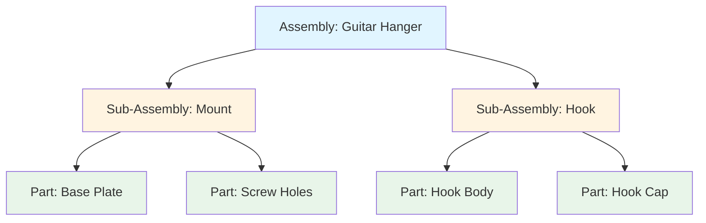

# Reference-Based vs Hierarchical Assembly

This diagram illustrates the key difference between TiaCAD's reference-based composition model and traditional CAD's hierarchical assembly model.

## Traditional CAD (Hierarchical)

**Characteristics:**
- Parent-child relationships
- Nested hierarchy
- Parts "belong to" assemblies
- Rigid structure

## TiaCAD (Reference-Based)

**Characteristics:**
- All parts are peers (no parent-child)
- Spatial anchors define relationships
- Parts are independent
- Flexible composition

## Key Differences

| Aspect | Traditional CAD | TiaCAD |
|--------|----------------|--------|
| Structure | Tree (hierarchical) | Graph (peer-based) |
| Relationships | Parent owns child | Part references anchor |
| Organization | Assembly → Sub-assembly → Part | Part → Part → Part |
| Positioning | Mate constraints | Spatial anchors |
| Flexibility | Rigid hierarchy | Flexible references |

## Mental Model

**Traditional CAD:** "This part belongs in this assembly"
**TiaCAD:** "This part is positioned at this anchor"

Think of TiaCAD like marking spots on a workbench where things go, rather than organizing parts into nested folders.
