# Auto-Reference Visualization

This diagram shows the auto-generated anchors (spatial references) that TiaCAD creates for every part.

## Box with Auto-Generated Anchors

```mermaid
graph TB
    subgraph "Box Part (10×10×20 units)"
        center["🎯 center<br/>(5, 5, 10)"]
        origin["📍 origin<br/>(0, 0, 0)"]

        face_top["⬆️ face_top<br/>(5, 5, 20)"]
        face_bottom["⬇️ face_bottom<br/>(5, 5, 0)"]
        face_left["⬅️ face_left<br/>(0, 5, 10)"]
        face_right["➡️ face_right<br/>(10, 5, 10)"]
        face_front["⬆️ face_front<br/>(5, 0, 10)"]
        face_back["⬇️ face_back<br/>(5, 10, 10)"]

        axis_x["↔️ axis_x<br/>X direction"]
        axis_y["↕️ axis_y<br/>Y direction"]
        axis_z["⬆️ axis_z<br/>Z direction"]
    end

    style center fill:#ffeb3b
    style origin fill:#f44336,color:#fff
    style face_top fill:#4caf50,color:#fff
    style face_bottom fill:#4caf50,color:#fff
    style face_left fill:#2196f3,color:#fff
    style face_right fill:#2196f3,color:#fff
    style face_front fill:#9c27b0,color:#fff
    style face_back fill:#9c27b0,color:#fff
    style axis_x fill:#ff9800,color:#fff
    style axis_y fill:#ff9800,color:#fff
    style axis_z fill:#ff9800,color:#fff
```



## Anchor Categories

### Position Anchors
- **`center`** - Geometric center of the part
- **`origin`** - Part's local origin (often corner for boxes)

### Face Anchors
- **`face_top`** - Center of top face (+Z direction)
- **`face_bottom`** - Center of bottom face (-Z direction)
- **`face_left`** - Center of left face (-X direction)
- **`face_right`** - Center of right face (+X direction)
- **`face_front`** - Center of front face (-Y direction)
- **`face_back`** - Center of back face (+Y direction)

### Direction Anchors
- **`axis_x`** - X-axis direction vector
- **`axis_y`** - Y-axis direction vector
- **`axis_z`** - Z-axis direction vector

## Usage Example

```yaml
parts:
  base:
    primitive: box
    parameters:
      width: 10
      height: 20
      depth: 10
    # Automatically provides: base.center, base.face_top, etc.

  pillar:
    primitive: cylinder
    parameters:
      radius: 2
      height: 15
    translate:
      to: base.face_top  # Use auto-generated anchor!
```

## Benefits

✅ **No manual anchor definitions needed**
✅ **Consistent naming across all parts**
✅ **Self-documenting positioning**
✅ **Includes orientation information (normals)**

## 3D Visualization Concept

```
        face_top (5,5,20)
             ▲
             │
    ┌────────┼────────┐
    │        │        │
    │     center      │  ← face_right (10,5,10)
    │     (5,5,10)    │
    │        │        │
    └────────┼────────┘
    origin   │
    (0,0,0)  ▼
        face_bottom (5,5,0)
```

**Note:** Every primitive (box, cylinder, sphere, cone) and every sketch operation (extrude, revolve, sweep, loft) automatically generates these anchors.
