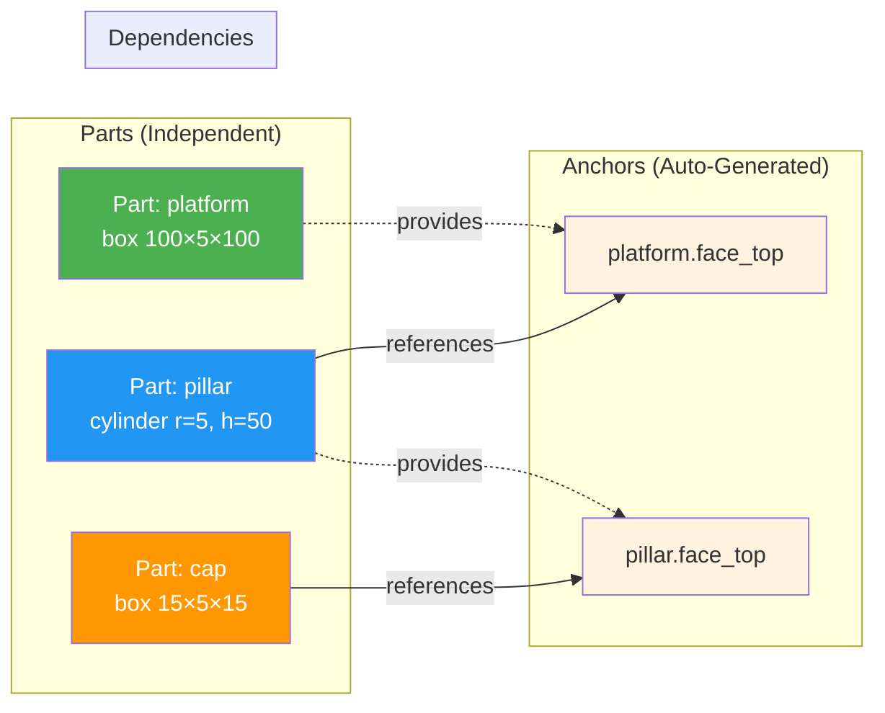
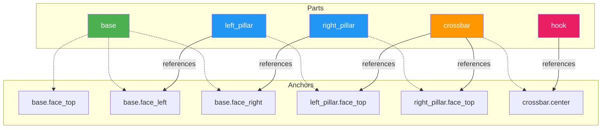
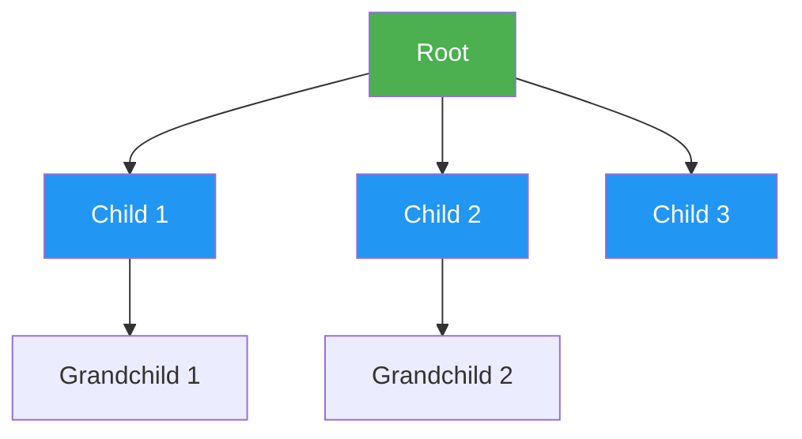
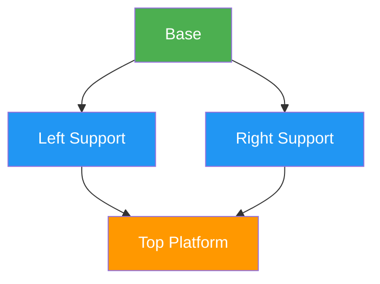
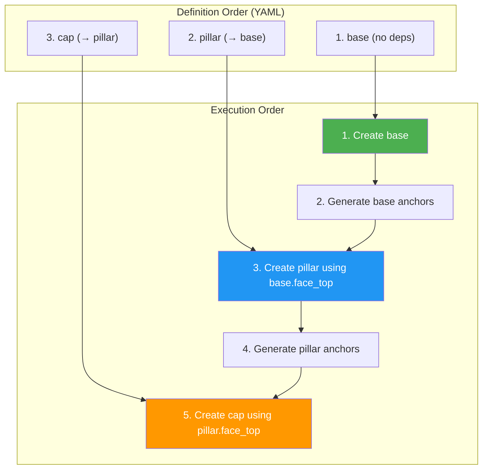

# Reference Chain Dependencies

This diagram shows how parts reference each other's anchors, creating dependency chains.

## Simple Reference Chain



## Complex Assembly with Multiple References



## Dependency Resolution Order

TiaCAD resolves references in the order parts are defined:

```yaml
parts:
  # 1. base - no dependencies, created first
  base:
    primitive: box
    parameters: {width: 100, height: 5, depth: 100}

  # 2. pillar - depends on base, created second
  pillar:
    primitive: cylinder
    parameters: {radius: 5, height: 50}
    translate:
      to: base.face_top  # ✅ base exists, reference resolved

  # 3. cap - depends on pillar, created third
  cap:
    primitive: box
    parameters: {width: 15, height: 5, depth: 15}
    translate:
      to: pillar.face_top  # ✅ pillar exists, reference resolved
```

## Invalid Reference Chains

### Circular Dependency (❌ Error)

```yaml
parts:
  part_a:
    translate:
      to: part_b.face_top  # ❌ part_b doesn't exist yet!

  part_b:
    translate:
      to: part_a.face_top  # ❌ Circular reference!
```

**Error:** `Circular dependency detected: part_a → part_b → part_a`

### Forward Reference (❌ Error)

```yaml
parts:
  tower:
    translate:
      to: base.face_top  # ❌ base doesn't exist yet!

  base:
    primitive: box
```

**Error:** `Reference 'base.face_top' not found (part 'base' not defined yet)`

## Valid Dependency Patterns

### Linear Chain ✅


**Order matters:** A → B → C → D

### Tree Structure ✅



**All children reference root, grandchildren reference children**

### Diamond (Multi-Reference) ✅



**Top references both left and right supports**

## Custom Anchors in Reference Chains

You can define custom anchors that reference other parts:

```yaml
parts:
  base:
    primitive: box
    parameters: {width: 100, height: 5, depth: 100}

  pillar:
    primitive: cylinder
    parameters: {radius: 5, height: 50}
    translate:
      to: base.face_top

anchors:
  # Custom anchor that combines multiple references
  assembly_top:
    from: pillar.face_top
    offset: [0, 0, 10]

  # Another part can reference this custom anchor
  flag:
    primitive: box
    parameters: {width: 2, height: 20, depth: 2}
    translate:
      to: assembly_top  # References custom anchor
```

## Dependency Graph Visualization



## Best Practices

### ✅ DO: Define parts in dependency order

```yaml
parts:
  foundation:  # No dependencies
    ...
  walls:       # Depends on foundation
    translate: {to: foundation.face_top}
  roof:        # Depends on walls
    translate: {to: walls.face_top}
```

### ✅ DO: Use descriptive part names

```yaml
parts:
  mounting_plate:  # Clear name
    ...
  left_bracket:    # Clear spatial relationship
    translate: {to: mounting_plate.face_left}
```

### ❌ DON'T: Create circular dependencies

```yaml
parts:
  a:
    translate: {to: b.center}  # ❌ b doesn't exist yet
  b:
    translate: {to: a.center}  # ❌ Circular!
```

### ❌ DON'T: Reference undefined parts

```yaml
parts:
  top:
    translate: {to: base.face_top}  # ❌ base not defined yet
  base:
    ...
```

## Summary

| Concept | Key Point |
|---------|-----------|
| **Independence** | Parts don't "own" other parts |
| **References** | Parts reference spatial anchors |
| **Order** | Define parts before referencing them |
| **Chains** | References can chain: A → B → C |
| **Validation** | TiaCAD detects circular dependencies |
| **Flexibility** | Same part can be referenced by multiple others |
